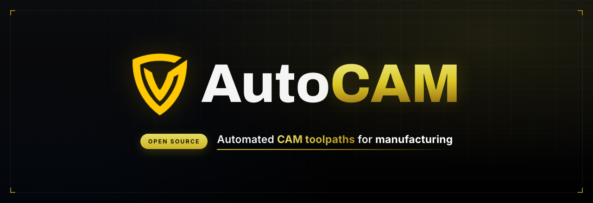

<div align="center">



<br />

**Multi-tenant CAM workflow platform for teams — parts, plates, tooling, and automated job queues.**

🌐 **Live at [cam.valor6800.com](https://cam.valor6800.com)**

<br />

[](https://cam.valor6800.com)
[](LICENSE)
[](https://github.com/AutoCAM-FRC/AutoCAM/stargazers)
[](https://github.com/AutoCAM-FRC/AutoCAM/network/members)
[](https://github.com/AutoCAM-FRC/AutoCAM/issues)
[](https://github.com/AutoCAM-FRC/AutoCAM/pulls)
[](https://github.com/AutoCAM-FRC/AutoCAM/commits)

<br />


<br />

[**Live App**](https://cam.valor6800.com) · [**Getting Started**](#-getting-started) · [**Architecture**](#-architecture) · [**API & Auth**](#-api--authentication) · [**Fusion Runner**](#-fusion-360-runner) · [**Contributing**](#-contributing) · [**Security**](SECURITY.md)

</div>

---

## Overview

**AutoCAM** is a multi-tenant CAM (Computer-Aided Manufacturing) SaaS platform. It gives fabrication teams a single dashboard to manage the full path from raw stock to cut parts — materials, machines, tools, parts, plates, and box tubes — and coordinates the heavy CAM work through an asynchronous job queue that runners — the [**Runner Fusion 360 add-in**](https://github.com/AutoCAM-FRC/Runner) — claim and process.

Everything is scoped to a `team_id` for strict multi-tenancy, with dual authentication (user sessions **or** scoped API keys) so both humans and machine runners can talk to the same API.

## ✨ Features

- 🏭 **Team-based CAM dashboard** — parts, plates, materials, machines, tools, and box tubes in one workspace
- ⚙️ **Automated job queue** — `plate:arrange`, `plate:cam`, and `box_tube` jobs claimed by runners via digest hashes to prevent duplicate work
- 🔑 **Scoped API keys** — fine-grained read/write/process permissions for Fusion 360 runners and integrations
- 🔐 **Dual auth** — Better Auth email/password sessions **plus** `Authorization: Bearer` API keys
- 📦 **S3-backed uploads** — file storage for part and plate assets
- 📖 **OpenAPI docs** — generated reference routes for integration work
- ✉️ **Email verification** — transactional email via SMTP

## 🧰 Tech Stack

| Layer | Technology |
| --- | --- |
| Framework | Next.js 16 (App Router) · React 19 · React Compiler |
| API | tRPC · Zod · `@asteasolutions/zod-to-openapi` |
| Database | PostgreSQL · Drizzle ORM · Drizzle Kit |
| Auth | Better Auth (sessions + API keys) |
| Storage | AWS S3 (`@aws-sdk/client-s3`) |
| Email | Nodemailer (SMTP) |
| UI | CSS Modules · Framer Motion · GSAP · Bootstrap 5 |
| Tooling | Bun · Vitest · ESLint |

## 🚀 Getting Started

### Prerequisites

- **Bun** 1.1+ (or Node.js with npm)
- **PostgreSQL** database
- **SMTP** credentials for verification emails
- **S3-compatible** storage for uploads

### Installation

```bash
# 1. Clone
git clone https://github.com/AutoCAM-FRC/AutoCAM.git
cd AutoCAM

# 2. Configure environment
cp .env.example .env   # then fill in local values

# 3. Install dependencies
bun install

# 4. Run migrations
bunx drizzle-kit migrate

# 5. Start the dev server
bun dev
```

Open **[http://localhost:3000](http://localhost:3000)**.

### Scripts

```bash
bun dev          # Start dev server (localhost:3000)
bun run build    # Production build
bun run start    # Start production server
bun run lint     # ESLint
bun test         # Vitest
```

## 🗄️ Database

The schema source lives in `lib/db/schema/` and is managed with **Drizzle Kit**.

```bash
bunx drizzle-kit generate   # Generate migrations from schema changes
bunx drizzle-kit migrate    # Apply migrations (uses ADMIN_DB_URL)
bunx drizzle-kit push       # Push schema directly (dev only)
```

`ADMIN_DB_URL` must point at a database user with migration privileges. `DATABASE_URL` is the normal application connection string.

Schema is split into three files:

| File | Contents |
| --- | --- |
| `schema/auth.ts` | Better Auth tables — `user`, `session`, `account`, `verification` |
| `schema/entities.ts` | Team infrastructure — `Teams`, `TeamMembers`, `TeamInvites`, `TeamKeys`, `TeamRunners` |
| `schema/cam.ts` | Core CAM models — `Parts`, `Plates`, `Materials`, `Machines`, `Tools`, `Jobs`, `BoxTubes`, `PartCategories` |

## 🏛 Architecture

```
app/                    # Next.js App Router pages and API routes
├── api/                # API routes (delegate to lib/api/ implementations)
├── dashboard/          # Protected dashboard with parallel routes (@tabs)
├── login/, signup/     # Auth pages
└── pc/[id]/[teamid]/   # Part Categories workflow

lib/                    # Core business logic
├── db/                 # Drizzle setup + schema (auth, entities, cam)
├── api/                # API implementations (called by app/api/ routes)
├── auth/               # Better Auth server/client configuration
├── scopes.ts           # API key scope definitions
├── aws.ts              # S3 client
└── mailer.ts           # Nodemailer config

components/             # Reusable React components
proxy.ts                # Auth middleware (redirects)
```

**API pattern** — thin routes in `app/api/` delegate to implementations in `lib/api/`:

```typescript
// app/api/materials/route.ts
import { GET, POST, PUT, DELETE } from "@/lib/api/materials";
export { GET, POST, PUT, DELETE };
```

Shared helpers live in `lib/api/common.ts`: `routeFactory()`, `validateAuthType()`, `checkUserTeam()`, and `parseSchema()`.

### Job Queue

Jobs move through states: `pending` → `claimed_by` (runner digest) → `response` (completed). Job kinds are `plate:arrange`, `plate:cam`, and `box_tube`. Runners claim jobs by digest hash to guarantee a job is processed exactly once.

## 🔐 API & Authentication

AutoCAM supports two authentication modes against the same API:

1. **User sessions** — Better Auth cookies (email/password + verification)
2. **API keys** — `Authorization: Bearer <token>` for runners and integrations

API keys carry scoped permissions defined in `lib/scopes.ts`:

```typescript
{ materials: { read, write }, jobs: { read, create, process, delete }, ... }
```

Protected routes are guarded by middleware in `proxy.ts`, which redirects unauthenticated users.

## 🤖 Fusion 360 Runner

The heavy CAM work doesn't run in the browser — it's executed by a companion **Fusion 360 add-in** that acts as a runner. It authenticates with a scoped runner API key, polls this app's job queue, generates CAM setups and G-code in Fusion, and reports results back.

➡️ **[Runner · Fusion 360 Add-in →](https://github.com/AutoCAM-FRC/Runner)**

Typical setup order:

1. Deploy this WebUI (see [Getting Started](#-getting-started)) — or use the hosted app at [cam.valor6800.com](https://cam.valor6800.com)
2. Create a team and generate a **runner API key** with `jobs` scopes
3. Install the [Runner add-in](https://github.com/AutoCAM-FRC/Runner) and point it at your `BASE_URL` with that key
4. Queue jobs from the dashboard — the runner claims and processes them

## ⚙️ Environment

All required variables are documented in `.env.example`. Key ones:

| Variable | Purpose |
| --- | --- |
| `DATABASE_URL` | PostgreSQL connection string |
| `ADMIN_DB_URL` | Admin DB URL for migrations |
| `BASE_URL` | Application base URL |
| `SMTP_SENDER` | Email sender address |
| `AUTOCAM_BUCKET` | S3 bucket for file uploads |
| `API_KEY_DIGEST_SECRET` | Secret for hashing API-key digests |

> ⚠️ Never commit `.env` or production credentials. API-key digests depend on `API_KEY_DIGEST_SECRET` — changing it invalidates all existing stored digests.

## 🤝 Contributing

Contributions are welcome! Please read **[CONTRIBUTING.md](CONTRIBUTING.md)** before opening a pull request, and see **[AGENTS.md](AGENTS.md)** / **[CLAUDE.md](CLAUDE.md)** for repo conventions.

1. Fork the repo and create a feature branch
2. Make your changes with tests where appropriate
3. Run `bun run lint` and `bun test`
4. Open a pull request describing the change

## 🛡️ Security

Found a vulnerability? Please review our **[Security Policy](SECURITY.md)** and report responsibly rather than opening a public issue.

## 📄 License

Distributed under the **MIT License**. See [`LICENSE`](LICENSE) for details.

<div align="center">
<br />
<sub>Built for the shop floor · <b>AutoCAM</b> — Automated CAM toolpaths for manufacturing</sub>
</div>
